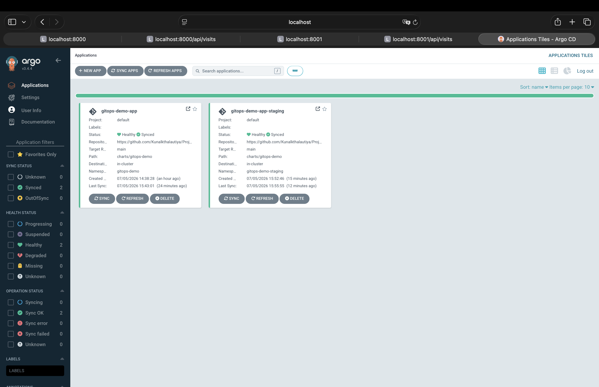
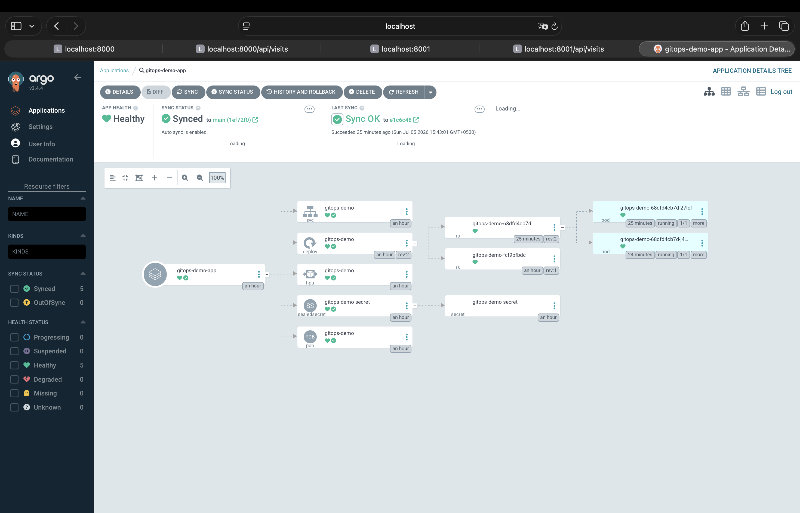
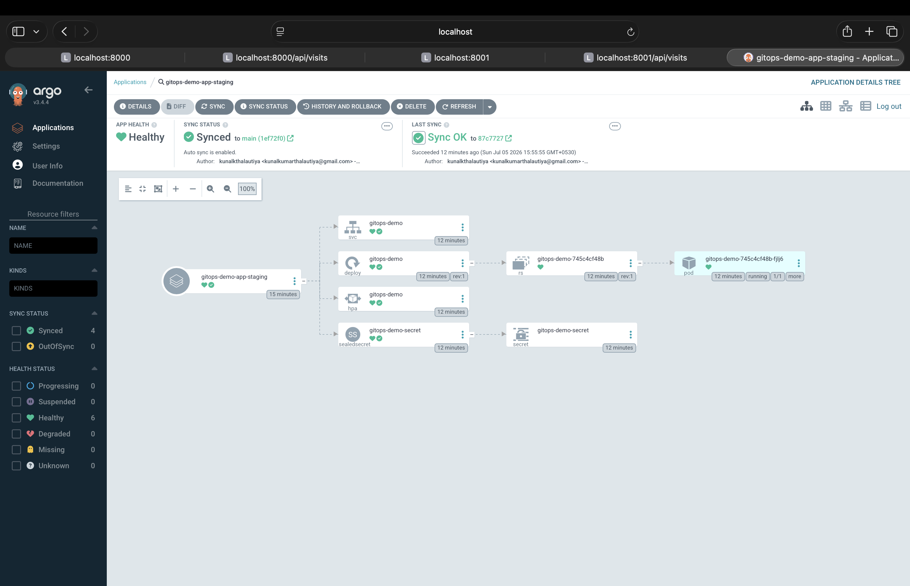
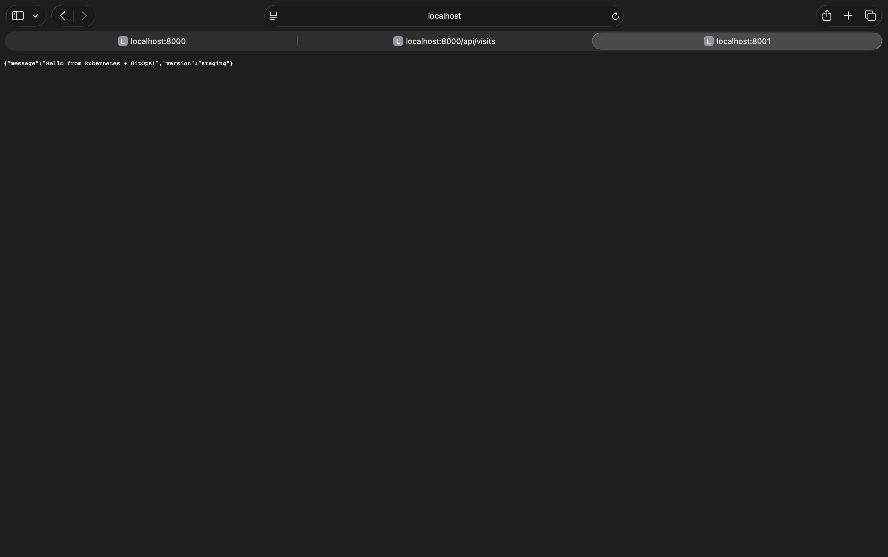
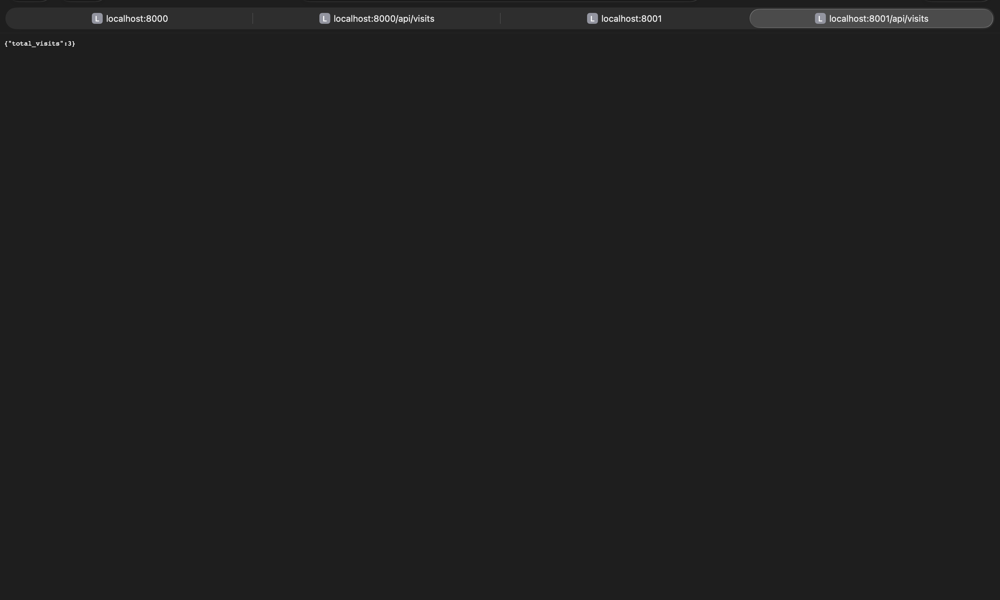
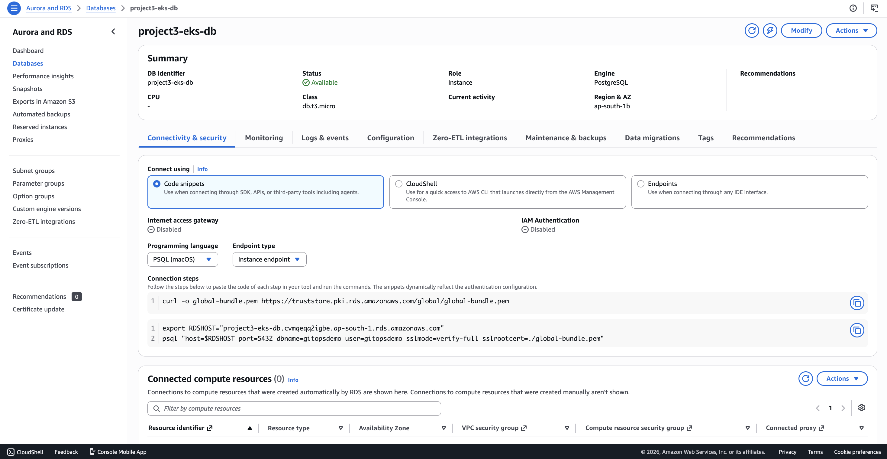
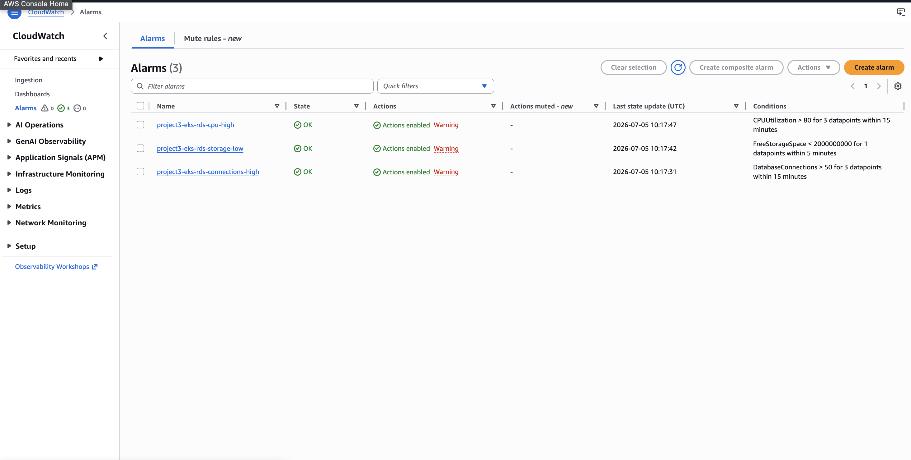
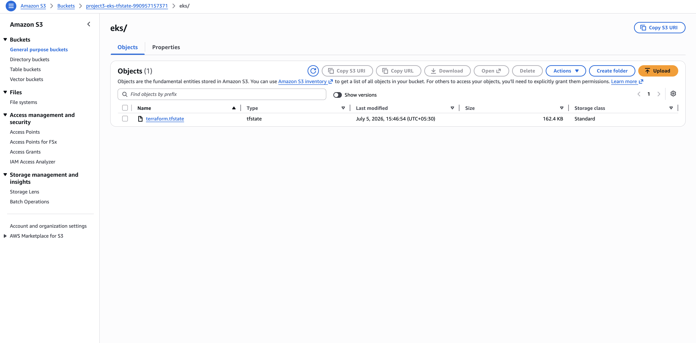
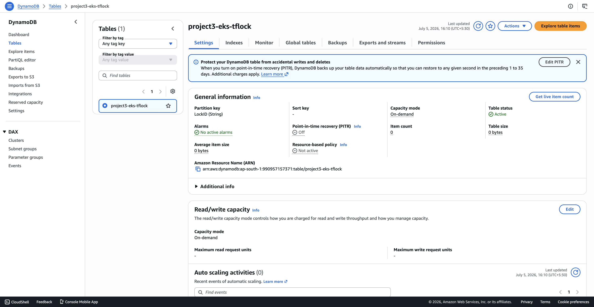

# Project 3 — Kubernetes + GitOps (Industry-Style)

A multi-tier, multi-environment Kubernetes deployment modeled on how real teams run GitOps: Helm
for packaging, GitHub Actions for CI, GHCR as the image registry, Argo CD Image Updater for
tag rollout, Sealed Secrets for encrypted credentials in git, ArgoCD continuously reconciling
prod and staging environments, a managed RDS Postgres data tier, and Terraform-provisioned AWS
EKS (with remote state) as the real cluster — alongside a minikube path for local development.

Full docs: [docs/architecture.md](docs/architecture.md) · [docs/eks-migration.md](docs/eks-migration.md) · [docs/troubleshooting.md](docs/troubleshooting.md)

## Screenshots

**ArgoCD — both environments, one glance**
| Both Applications (prod + staging), both Healthy/Synced | Prod — full resource tree |
|---|---|
|  |  |

| Staging — full resource tree (separate namespace) |
|---|
|  |

**App — prod vs staging, isolated data**
| Prod (`version: v1`) | Staging (`version: staging`) |
|---|---|
|  |  |

| Prod `/api/visits` | Staging `/api/visits` (separate counter → separate DB) |
|---|---|
|  |  |

**AWS infrastructure**
| EKS cluster (Active) | EKS nodes (2× t3.small, Ready) |
|---|---|
|  |  |

| RDS PostgreSQL (Available, db.t3.micro) | CloudWatch alarms (all OK) |
|---|---|
|  |  |

| Terraform remote state (S3) | Terraform state lock (DynamoDB) |
|---|---|
|  |  |

## Architecture

```
Developer pushes to app/
        |
        v
GitHub Actions:  test -> build image -> push to GHCR -> scan (Trivy)
        |
        v
Argo CD Image Updater watches GHCR -> writes new tag to values.yaml / values-staging.yaml
        |
        v
Git repo (charts/gitops-demo) is the source of truth for BOTH environments
        |
        v
ArgoCD: gitops-demo-app (prod)  ---->  namespace gitops-demo
        gitops-demo-app-staging ---->  namespace gitops-demo-staging
        |
        v
   App tier (Deployment) <--> Data tier (RDS Postgres, separate logical DB per environment)
```

No one runs `kubectl apply`, `docker push`, or hand-bumps an image tag — CI, Image Updater, and
ArgoCD do all of it.

## Stack

| Concern            | Tool                                                          |
|---------------------|----------------------------------------------------------------|
| Cluster             | minikube (local) or AWS EKS (Terraform, `infra/eks/`, remote S3+DynamoDB state) |
| Packaging           | Helm chart, with a `values-staging.yaml` overlay for a second environment |
| CI                  | GitHub Actions — test, build, push, scan only                |
| Image rollout       | **Argo CD Image Updater** — watches GHCR, writes tag back to git itself |
| Image registry      | GHCR (ghcr.io), private                                       |
| Vulnerability scan  | Trivy (report-only in this demo)                              |
| GitOps sync         | ArgoCD — two `Application`s (prod + staging) from one chart   |
| Secrets in git      | Sealed Secrets (Bitnami) — cluster- and namespace-specific, re-sealed per target |
| App tier            | Flask (Deployment, 2 replicas prod / 1 staging)               |
| Data tier           | **RDS PostgreSQL** (`db.t3.micro`), one instance, separate logical DB per environment |
| Autoscaling         | HPA (CPU-based, app tier)                                     |
| Availability        | PodDisruptionBudget (prod only)                               |
| Monitoring/alerting | CloudWatch alarms (RDS CPU/storage/connections) → SNS topic   |

## Repo structure

```
app/                              Flask app, Dockerfile, pytest tests
charts/gitops-demo/
  values.yaml                     Prod defaults
  values-staging.yaml             Staging overlay (1 replica, separate DB name, APP_VERSION=staging)
  templates/deployment.yaml       App tier
  templates/service.yaml          App tier Service
  templates/postgres-statefulset.yaml   In-cluster Postgres (disabled by default — see Data tier)
  templates/sealedsecret.yaml           Prod secret (namespace: gitops-demo)
  templates/sealedsecret-staging.yaml    Staging secret (namespace: gitops-demo-staging)
  templates/hpa.yaml, pdb.yaml     Autoscaling + availability
argocd/
  application.yaml          Prod Application (+ Image Updater annotations)
  application-staging.yaml  Staging Application (+ Image Updater annotations)
.github/workflows/ci.yml    CI: test, build, push, scan — no longer touches git
infra/
  bootstrap/    S3 bucket + DynamoDB table for Terraform remote state
  eks/          VPC + EKS + node group + RDS + CloudWatch alarms/SNS
docs/           Architecture, EKS migration notes, troubleshooting log, screenshots
```

## CI/CD flow

**`.github/workflows/ci.yml`** — on every push to `app/`:
1. **test** — `pytest` against the Flask app.
2. **build-and-push** — builds the Docker image, tags with the short commit SHA, pushes to
   `ghcr.io/kunalkthalautiya/gitops-demo-app`, scans it with Trivy (report-only).

That's it — CI's job ends at "image exists in the registry." It does **not** touch git.

**Argo CD Image Updater** takes over from there: it polls GHCR, finds the new commit-SHA tag
(matching `allow-tags: regexp:^[0-9a-f]{7}$`), and writes it directly into `values.yaml` (prod
Application) or `values-staging.yaml` (staging Application) via a real git commit — configured
entirely through annotations on each `Application` resource, no CI step involved. ArgoCD then
syncs as usual. This replaces an earlier version of this pipeline that had CI commit the tag
bump itself (see [docs/troubleshooting.md](docs/troubleshooting.md) for why that pattern was
replaced).

## Two environments, one chart

`argocd/application.yaml` (prod → `gitops-demo` namespace) and `argocd/application-staging.yaml`
(staging → `gitops-demo-staging` namespace) both point at `charts/gitops-demo`, but the staging
Application also layers `values-staging.yaml` on top: fewer replicas, `APP_VERSION=staging`, and
a separate logical database (`gitopsdemo_staging` vs `gitopsdemo`) on the *same* RDS instance —
cheaper than a second database, while still keeping data fully isolated between environments.

Each environment needs its own `SealedSecret` (encryption is bound to a specific namespace), so
there are two secret templates, each gated by `{{- if eq .Values.environment "..." }}` — only the
one matching the active values file renders.

## Data tier

The app talks to a **managed RDS PostgreSQL instance** (`infra/eks/main.tf`), not a database
running in the cluster. `GET /api/visits` inserts a row and returns the running count — proof the
app persists real state rather than talking to a mock.

An in-cluster Postgres `StatefulSet` still exists in the chart (`postgres.enabled: false` by
default) purely so this same chart still works standalone against minikube, where there's no RDS
to point at — flip `postgres.enabled: true` and `DB_HOST: postgres` for that path. Everything
running against EKS uses RDS.

**Why RDS over in-cluster**: managed backups, patching, and failover are handled by AWS instead of
hand-rolled `pg_dump` CronJobs and StatefulSet operational overhead — the standard trade-off real
teams make once a workload needs actual durability guarantees.

## Secrets handling

Real credentials are never committed in plaintext. Each `SealedSecret` is encrypted with the
target cluster's Sealed Secrets controller public key — only that specific controller can decrypt
it back into a real `Secret`, consumed by the app via `envFrom`. Losing control of this (already
private) git repo does not leak a single credential.

## Registry & pull access

The GHCR package is private. Each namespace needs its own `imagePullSecret`
(`ghcr-pull-secret`) to pull it — created out-of-band with `kubectl create secret
docker-registry`, never stored in git.

## Terraform remote state

`infra/bootstrap/` provisions an S3 bucket (versioned, encrypted, public access blocked) and a
DynamoDB table, used as `infra/eks/`'s remote backend (`versions.tf`). State is no longer a local
file — it's shared, locked against concurrent applies, and durable independently of this laptop.

## Monitoring & alerting

Three CloudWatch alarms watch the RDS instance (CPU > 80%, free storage < 2GB, connection count >
50), all wired to an SNS topic (`infra/eks/variables.tf`'s `alert_email` subscribes an inbox if
set). EKS worker nodes already span 2 AZs (the node group's subnets cover both), so compute-level
redundancy exists without extra configuration; RDS itself runs single-AZ for cost
(`multi_az = false`, a one-line flip for real HA — see [docs/eks-migration.md](docs/eks-migration.md)).

## Local setup (minikube)

```bash
minikube start --driver=docker

# ArgoCD
kubectl create namespace argocd
kubectl apply -n argocd -f https://raw.githubusercontent.com/argoproj/argo-cd/stable/manifests/install.yaml --server-side --force-conflicts

# Sealed Secrets controller
kubectl apply -f https://github.com/bitnami-labs/sealed-secrets/releases/download/v0.27.1/controller.yaml

# Register this (private) repo with ArgoCD — see argocd/application.yaml for the repo Secret format
kubectl apply -f argocd/application.yaml

# Image pull secret for the private GHCR package
kubectl create secret docker-registry ghcr-pull-secret -n gitops-demo \
  --docker-server=ghcr.io --docker-username=<gh-username> --docker-password=<gh-token-with-read:packages>
```
On minikube, also flip `postgres.enabled: true` / `DB_HOST: postgres` in `values.yaml` — there's
no RDS to reach from a local cluster.

## Running on real AWS EKS

```bash
cd infra/bootstrap && terraform init && terraform apply   # one-time, creates the state backend
cd ../eks && terraform init && terraform plan -out=tfplan && terraform apply "tfplan"
aws eks update-kubeconfig --region ap-south-1 --name project3-eks
```
Then install ArgoCD, Sealed Secrets, and Argo CD Image Updater the same way as the minikube path,
plus register repo credentials and image-pull secrets per namespace. Full walkthrough, real
gotchas hit (pod density limits, cluster-specific Sealed Secrets keys, missing EBS CSI driver,
Postgres version availability), and teardown steps: [docs/eks-migration.md](docs/eks-migration.md).

**Cost note**: this is not free. Running continuously: EKS control plane (~$73/mo) + 2×`t3.small`
nodes (~$30/mo) + NAT gateway (~$32/mo) + RDS `db.t3.micro` (~$15/mo) ≈ **$150/month**. Destroy
after a demo: `cd infra/eks && terraform destroy`.

## Next steps

- Add a `pg_dump`-to-S3 backup job for RDS (AWS-managed automated backups already run daily with
  a 1-day retention window here — a longer-retention export is the next layer).
- Turn on RDS `multi_az = true` for real HA (currently single-AZ for cost).
- Full cluster-level observability (Container Insights or a Prometheus/Grafana stack) — current
  monitoring is scoped to the RDS tier only.
- CI-driven `terraform plan` on PRs against `infra/`, rather than applying by hand.
