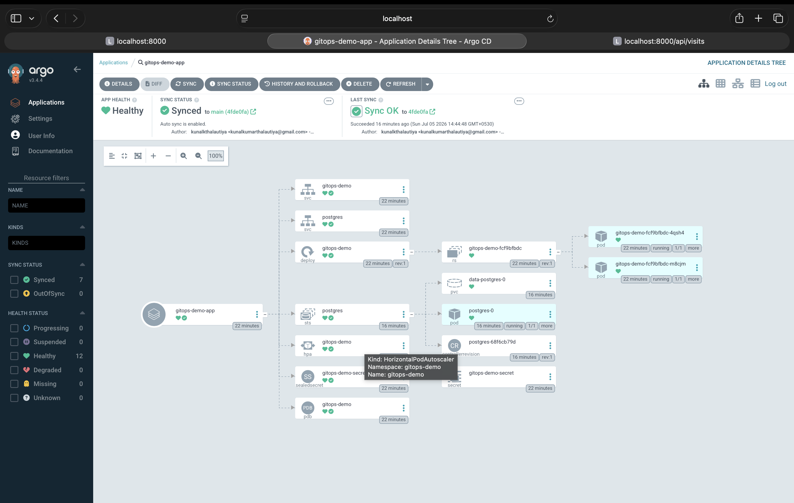
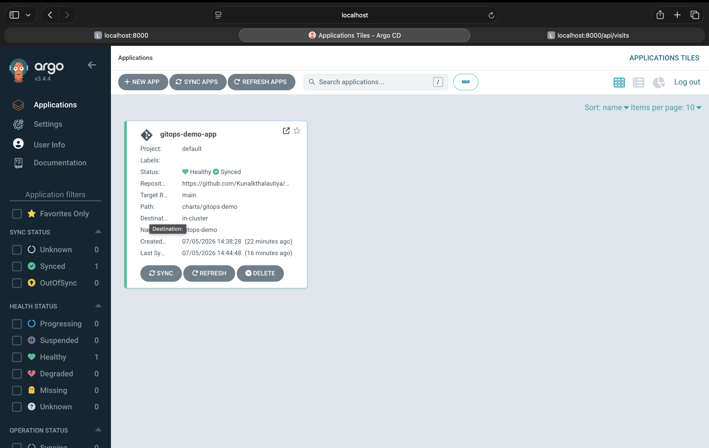
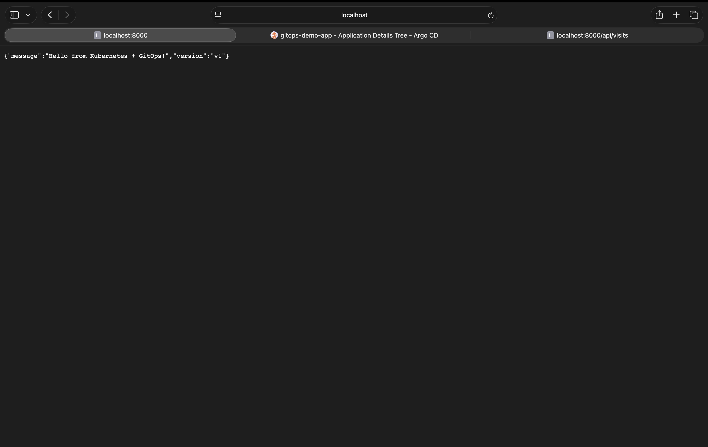
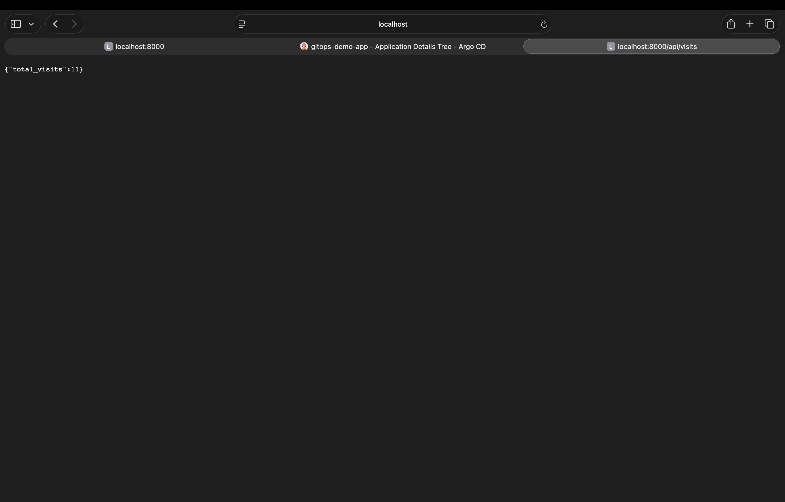
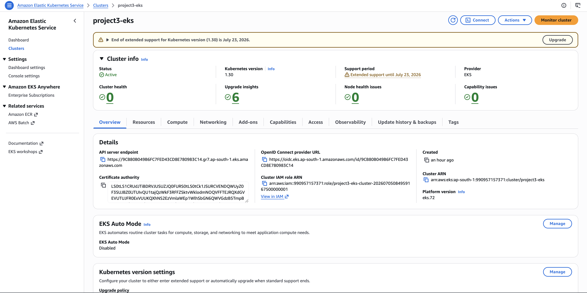
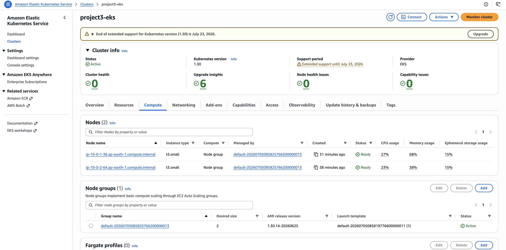

# Project 3 — Kubernetes + GitOps (Industry-Style)

A multi-tier Kubernetes deployment modeled on how real teams run GitOps: Helm for packaging,
GitHub Actions for CI, GHCR as the image registry, Sealed Secrets for encrypted credentials
in git, ArgoCD continuously reconciling the cluster to match this repo, a stateful
Postgres data tier backing the app, and Terraform-provisioned AWS EKS as the real cluster
(alongside a minikube path for local development).

Full docs: [docs/architecture.md](docs/architecture.md) · [docs/eks-migration.md](docs/eks-migration.md) · [docs/troubleshooting.md](docs/troubleshooting.md)

## Screenshots

| ArgoCD — resource tree (all Healthy/Synced) | ArgoCD — application tile |
|---|---|
|  |  |

| App response | `/api/visits` (Postgres persistence) |
|---|---|
|  |  |

| EKS cluster (AWS Console) | EKS nodes (2x t3.small, Ready) |
|---|---|
|  |  |

## Architecture

```
Developer pushes to app/
        |
        v
GitHub Actions:  test -> build image -> push to GHCR -> scan (Trivy) -> bump image tag in values.yaml (commit-back)
        |
        v
Git repo (charts/gitops-demo) is now the source of truth
        |
        v
ArgoCD watches the repo -> auto-syncs -> Kubernetes cluster (minikube or AWS EKS)
        |
        v
   App tier (Deployment, 2 replicas) <--> Data tier (Postgres StatefulSet + PVC)
```

No one runs `kubectl apply` or `docker push` by hand — the pipeline and ArgoCD do it.

## Stack

| Concern            | Tool                                        |
|---------------------|----------------------------------------------|
| Cluster             | minikube (local) or AWS EKS (Terraform, `infra/eks/`) |
| Packaging           | Helm chart                                  |
| CI                  | GitHub Actions                              |
| Image registry      | GHCR (ghcr.io), private                     |
| Vulnerability scan  | Trivy (report-only in this demo)            |
| GitOps sync         | ArgoCD                                      |
| Secrets in git      | Sealed Secrets (Bitnami) — cluster-specific key, re-sealed per cluster |
| App tier            | Flask (Deployment, 2 replicas)              |
| Data tier           | Postgres (StatefulSet + PVC — EBS-backed `gp2` on EKS) |
| Autoscaling         | HPA (CPU-based, app tier only)              |
| Availability        | PodDisruptionBudget                         |

## Repo structure

```
app/                              Flask app, Dockerfile, pytest tests
charts/gitops-demo/
  templates/deployment.yaml       App tier
  templates/service.yaml          App tier Service
  templates/postgres-statefulset.yaml   Data tier (StatefulSet + volumeClaimTemplate)
  templates/postgres-service.yaml       Headless Service for Postgres DNS
  templates/sealedsecret.yaml      Encrypted app + DB credentials
  templates/hpa.yaml, pdb.yaml     Autoscaling + availability (app tier)
argocd/application.yaml   ArgoCD Application CR (cluster-side, not synced by ArgoCD itself)
.github/workflows/ci.yml  CI/CD pipeline
infra/eks/                Terraform for the real AWS EKS cluster (VPC + EKS + node group)
docs/                     Architecture, EKS migration notes, troubleshooting log
```

## CI/CD flow (`.github/workflows/ci.yml`)

1. **test** — runs `pytest` against the Flask app
2. **build-and-push** — builds the Docker image, tags it with the short commit SHA, pushes to
   `ghcr.io/kunalkthalautiya/gitops-demo-app`, then scans it with Trivy for CRITICAL/HIGH CVEs
3. **update-manifest** — bumps `charts/gitops-demo/values.yaml`'s `image.tag` to the new SHA and
   commits it back to `main` (GitOps commit-back pattern). This only touches `charts/`, which is
   outside the workflow's trigger paths, so it doesn't retrigger itself.

ArgoCD picks up that commit and rolls the new image out automatically.

## Data tier

Postgres runs as a `StatefulSet` (stable network identity + a `PersistentVolumeClaim` per pod,
via `volumeClaimTemplates`), backed by a headless `Service` (`clusterIP: None`) for stable DNS
(`postgres.gitops-demo.svc.cluster.local`). The app connects to it via `DB_HOST=postgres`.

`GET /api/visits` on the app inserts a row and returns the running count — a simple way to prove
the app is actually persisting to Postgres rather than talking to a mock/in-memory store.

**Gotcha hit and fixed**: the Postgres readiness/liveness probes originally used
`pg_isready -U $(POSTGRES_USER)` — the `$(VAR)` substitution syntax only works in a container's
`command`/`args` fields, not in `exec.command` for probes (no shell involved there). Fixed by
wrapping it as `["sh", "-c", "pg_isready -U $POSTGRES_USER"]` so the shell does the substitution.

## Secrets handling

Real credentials are never committed in plaintext. `charts/gitops-demo/templates/sealedsecret.yaml`
holds a `SealedSecret` — data encrypted with the in-cluster Sealed Secrets controller's public key.
Only that controller (running in the target cluster) can decrypt it back into a real `Secret`,
containing both the app's `DEMO_API_KEY` and the real Postgres credentials
(`POSTGRES_USER`, `POSTGRES_PASSWORD`, `POSTGRES_DB`), consumed via `envFrom` by both the app
Deployment and the Postgres StatefulSet. Losing control of this git repo does not leak the secret.

## Registry & pull access

The GHCR package is private (matches the private repo). The cluster needs an
`imagePullSecret` (`ghcr-pull-secret` in the `gitops-demo` namespace) to pull it — created
out-of-band with `kubectl create secret docker-registry`, not stored in git.

## Local setup (minikube)

```bash
minikube start --driver=docker

# ArgoCD
kubectl create namespace argocd
kubectl apply -n argocd -f https://raw.githubusercontent.com/argoproj/argo-cd/stable/manifests/install.yaml --server-side --force-conflicts

# Sealed Secrets controller
kubectl apply -f https://github.com/bitnami-labs/sealed-secrets/releases/download/v0.27.1/controller.yaml

# Register this (private) repo with ArgoCD — see argocd/application.yaml for the repo Secret format
kubectl apply -f argocd/application.yaml

# Image pull secret for the private GHCR package
kubectl create secret docker-registry ghcr-pull-secret -n gitops-demo \
  --docker-server=ghcr.io --docker-username=<gh-username> --docker-password=<gh-token-with-read:packages>
```

## Running on real AWS EKS

`infra/eks/` provisions a real cluster with Terraform (community `terraform-aws-modules/vpc`
and `terraform-aws-modules/eks` modules) — VPC, EKS control plane, and a managed node group.
See [docs/eks-migration.md](docs/eks-migration.md) for the full setup, the cluster-specific
issues hit along the way (pod density limits, cluster-specific Sealed Secrets keys, missing
EBS CSI driver), and how to tear it down.

**Cost note**: an EKS cluster is not free — control plane + nodes + NAT gateway run roughly
$120/month if left up. Destroy it after a demo: `cd infra/eks && terraform destroy`.

## Next steps

- Replace the commit-back tag bump with **Argo CD Image Updater** for a fully native GitOps flow (no bot commits).
- Add a staging environment via a second ArgoCD `Application` + Helm values overlay (`values-staging.yaml`).
- Replace in-cluster Postgres with a managed database (RDS, as in Project 2) for a production-realistic setup — the in-cluster StatefulSet here is deliberately chosen to demonstrate stateful workload management in Kubernetes itself.
- Add a `pg_dump` CronJob for backups — right now data only survives on the PVC, with no off-cluster backup.
- Move Terraform state to a remote backend (S3 + DynamoDB, as bootstrapped in Project 2) instead of local state.
